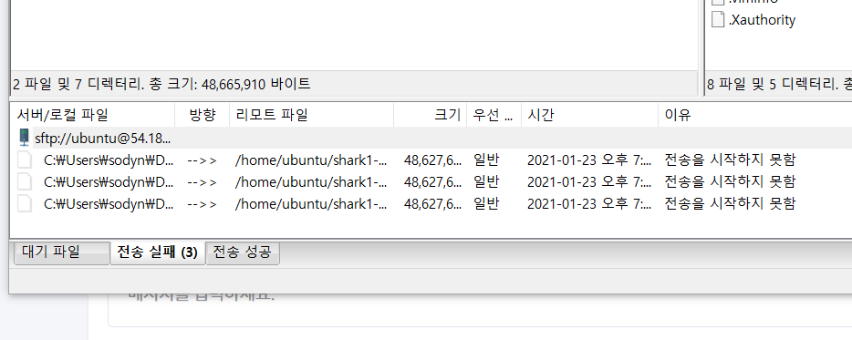

amz sftp 안붙을때 (ssh는 정상접속) 해결하는 방법.

<!-- more -->

## 문제 상황

SSH는 정상 접속 되는데 파일질라나 기타 mobaxterm 등 어떤 툴로도 sftp가 전송이 안되기 시작했다.

mobaXterm 에서 찍어보면 timeout 에러가 나거나 다른 방식을 사용해도 전송실패가 뜬다. 

## 해결 방법

이럴때는 주로 권한 문제다.

해당 /home/{userId} 의 권한을 확인한다. 

root로 되어있다면 chown userid.userid /home/{userid}로 권한을 변경해주면 정상적으로 작동한다.

